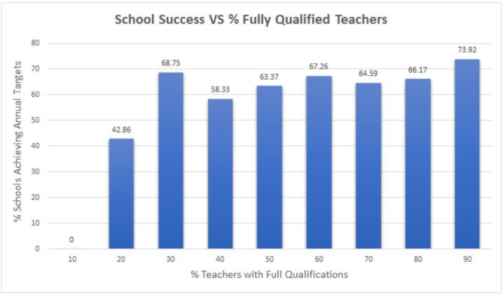
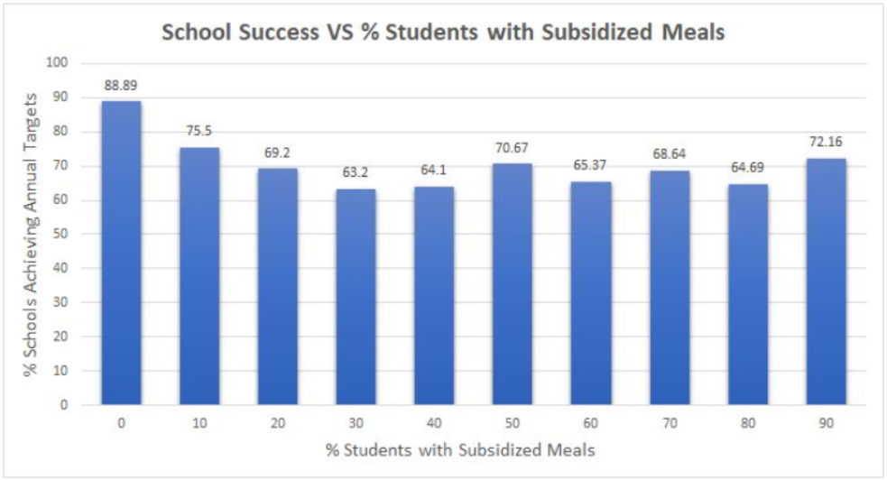
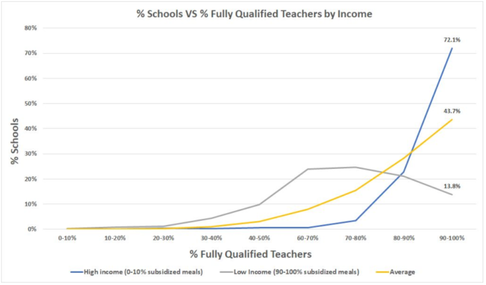

# An Analysis of Poverty and Education in California Public Schools

### Executive Summary
Americans depend on public education to socialize and cultivate the minds of each new
generation. Discrepancies in the quality of education between public schools undermines the
Department of Educations’ mission to foster “educational excellence and ensur[e] equal access.”
This analysis sheds light on the relationship between student poverty levels, school resource
access, and school success. Fewer students qualifying for subsidized meals, schools having more
fully-qualified teachers, and schools meeting their annual learning targets all correlate with one
another. This correlation suggests that poorer students receive a worse education than affluent
students on average. This analysis recommends further study to determine causality and
subsequent policy intervention as a remedy.

### Motivation
Public school education in the United States is often funded by property taxes of surrounding
areas. As a result, affluent neighborhoods tend to have better funded public schools. Well-funded
schools tend to do better than underfunded schools. This sequence of reasoning suggests that
children from affluent families (and thus neighborhoods) will receive a better education from
their public schools than children from poorer families, and would have wide-reaching
implications for education equity and policy. This paper will analyze California Schools
Academic Performance Index (API) data collected by the California Department of Education to
examine whether student poverty is correlated with a decrease in resources among public
schools. It will also examine these variables in relation to relative school success.

### Research Questions
1. Do schools with higher rates of impoverished students have equal access to qualified
    teaching staff?
2. Do schools with high rates of fully-qualified teachers tend to serve high income students?
3. How do the rates of poverty among students and full qualifications among teachers affect
    schools’ ability to reach their learning improvement targets?

### Data
The California Schools API data provides various instruments at the school-level including:
1. The percentage of students who qualify for subsidized meals (i.e. students whose
household income is below 185% of the poverty line),
2. The percentage of teachers who are fully qualified (as opposed to emergency certified),
3. Whether a school met its school-wide growth target and comparable improvement target.
This paper will use the percentage of students qualifying for subsidized meals as a relative
indicator of a school’s affluence. It will use the percentage of teachers who are fully qualified as
an indicator for how well-resourced a school is. And lastly, it will estimate a school’s success
based on whether or not it met its annual targets.

### Hypothesis
This analysis hypothesizes that the percentage of students qualifying for subsidized meals
correlates with the qualification rates of the teachers. More generally, it predicts that schools
with poorer students have access to fewer resources on average.

### Analysis
The data show that low levels of student poverty (i.e. fewer students receiving subsidized meals)
and higher levels of fully-qualified teachers predict school success. Schools with 90-100% fully
qualified teachers met their annual targets at a rate of 74% while schools with 10-20%
fully-qualified teachers met theirs at a rate of 43% (see Figure 1). Additionally, schools with
0-10% of students qualifying for subsidized meals met their targets at a rate of 89% while
schools with 90-100% subsidized meal-qualifying students met theirs at a rate of 77% (see
Figure 2). This data shows the explicit link between (1) teacher qualification rates and school
success and (2) student income level and school success.

Furthermore, schools with more students qualifying for subsidized meals did indeed have fewer
fully-qualified teachers on average (see Figure 3). Notice in Figure 3 the drastic difference
between (high income) schools with 0-10% of students having subsidized meals VS (low
income) schools with 90-100% of students having subsidized meals. Over 72% of these high
income schools had fully qualified teaching staff (90-100% qualified) compared to only 13.8%
of low income schools. The data shows an alarming trend: As the income of students at a school
increases, so does the percentage of qualified teaching staff. This finding supports the hypothesis
that student family income and school access to resources are not independent of one another.

### Limitations and Further Study
This analysis suffers from limitations in data and equity. While the indicators available are
helpful, they do not measure income or resource availability precisely and are estimates at best.
This analysis also did not account for race and--given that black and brown Americans tend to be
poorer--fails to provide information for a discussion regarding racially equitable education.

Additionally, this analysis does not define causal relationships between student family income,
school resource access, or school target achievement. For instance, it can not answer whether
student family income drives school achievement down. Continued study would benefit from
causal analysis of these factors as well as disaggregation by racial and ethnic identities.

### Policy Implications
Policymakers seeking to improve school success rates should focus on the dynamic between
student poverty, school resources, and school success. First steps may include allocating funding
for schools to hire more fully-qualified teachers but, as noted above, further analyses will
provide more targeted direction.

### Conclusion
This analysis examines the relationship between loosely defined indicators of student family
income, school resource access, and school success. While limited in scope, it shows that lower
income students more often attend schools with less qualified teachers, that schools serving low
income students tend to perform worse, and that schools with fewer qualified teachers also tend
to perform worse.

### Figures

#### Figure 1

#### Figure 2

#### Figure 3

